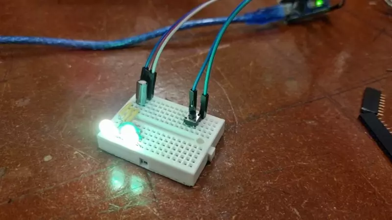

# CRF LED Arduino Startkit

## Parts needed

* Arduino Nano
* Breadboard
* 1x button
* 1x Capacitor 6.3v, 200 - 1000uF
* 2x APA-106 RGB LEDs

## Schematics

## Ideas

* Add more LEDs
* Add more effects 

## Links

* [Chalmers Robotics](https://chalmersrobotics.se/) 
* [FastLED Documentation](https://github.com/FastLED/FastLED/wiki/Overview)

